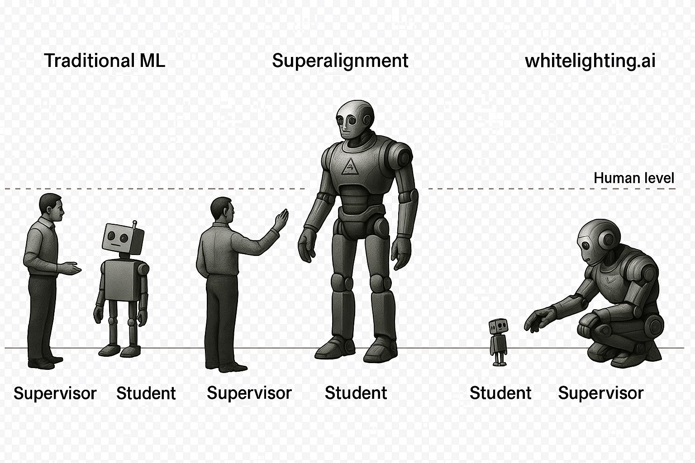

# WhiteLightning Website



## Overview

WhiteLightning is an innovative LLM distillation tool that enables you to create edge-ready AI models in one line with no data required. This repository contains the official website for WhiteLightning, showcasing its capabilities and providing comprehensive documentation.

## Features

- **💰 STOP PAYING FOR CLOUD APIs** - Own your models and run them locally without recurring API costs
- **🏃 RUN IT ANYWHERE** - Deploy on any device, no GPU required, optimized for low-resource environments
- **✏️ CREATE MODELS WITHOUT REAL DATA** - Generate synthetic training data using LLMs
- **🔒 CONTROL YOUR DATA** - No telemetry, no vendor lock-in, your data stays on your devices

## Quick Start

```bash
pip install -r requirements/base.txt
python -m text_classifier.agent -p "Classify customer reviews as positive, negative, or neutral"
```

## Website Structure

```
├── index.html              # Main landing page
├── docs.html              # Documentation page
├── examples.html          # Prompt examples
├── playground.html        # Interactive playground
├── binary-classifier.html # Binary classification setup
├── multiclass-classifier.html # Multiclass setup
├── running_bnr.html      # Binary running guide
├── running_mlt.html      # Multiclass running guide
├── arduino.html          # Arduino deployment guide
├── styles/               # CSS stylesheets
├── scripts/              # JavaScript files
├── media/                # Images and media assets
└── models/               # Model examples
```

## Development

### Prerequisites

- A modern web browser
- Basic knowledge of HTML, CSS, and JavaScript

### Local Development

1. Clone this repository:
```bash
git clone https://github.com/whitelightning-ai/whitelightning-site.git
cd whitelightning-site
```

2. Open `index.html` in your web browser or serve it using a local server:
```bash
# Using Python
python -m http.server 8000

# Using Node.js
npx serve .

# Using PHP
php -S localhost:8000
```

3. Navigate to `http://localhost:8000` to view the website

### Deployment

This website is designed to be deployed as a static site and can be hosted on:
- GitHub Pages
- Netlify
- Vercel
- Any static hosting service

## Process Flow

The WhiteLightning process follows these steps:

1. **💬 Prompt** - Describe your classification task
2. **🤖 Dummy Data** - AI generates synthetic training data
3. **🧠 Model** - Train an ultra-compact model
4. **📦 ONNX** - Export to industry-standard format
5. **🚀 Deploy** - Run anywhere from microcontrollers to mobile apps

## Links

- **GitHub Repository**: [whitelightning-ai/whitelightning](https://github.com/whitelightning-ai/whitelightning.git)
- **Documentation**: Start with our [Getting Started Guide](docs.html)
- **Playground**: Try the [Interactive Playground](playground.html)

## Contributing

We welcome contributions to improve the website! Please:

1. Fork the repository
2. Create a feature branch
3. Make your changes
4. Test thoroughly
5. Submit a pull request

## License

This project is licensed under the Apache License 2.0. See the [LICENSE](https://github.com/whitelightning-ai/whitelightning/blob/main/LICENSE) file for details.

## Contact

- **Email**: contact@whitelightning.ai
- **Issues**: [Report issues on GitHub](https://github.com/whitelightning-ai/whitelightning/issues)

## Support

Need help? Check out our:
- [Documentation](docs.html)
- [Examples](examples.html)
- [GitHub Issues](https://github.com/whitelightning-ai/whitelightning/issues)

---

© 2025 WhiteLightning Project | Apache License 2.0 